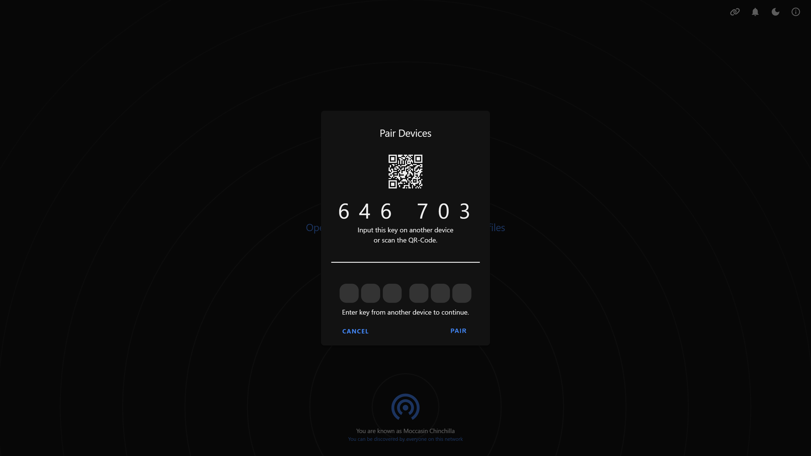

<!--
NOTA: Este README foi creado automáticamente por <https://github.com/YunoHost/apps/tree/master/tools/readme_generator>
NON debe editarse manualmente.
-->

# PairDrop para YunoHost

[](https://ci-apps.yunohost.org/ci/apps/pairdrop/)  

[](https://install-app.yunohost.org/?app=pairdrop)

*[Le este README en outros idiomas.](./ALL_README.md)*

> *Este paquete permíteche instalar PairDrop de xeito rápido e doado nun servidor YunoHost.*  
> *Se non usas YunoHost, le a [documentación](https://yunohost.org/install) para saber como instalalo.*

## Vista xeral

PairDrop is a sublime alternative to AirDrop that works on all platforms.

### Features

- File Sharing on your local network
	- Send images, documents or text via peer to peer connection to devices on the same local network.
- Internet Transfers
	- Join temporary public rooms to transfer files easily over the internet!
- Web-Application
	- As it is web based, it runs on all devices.


**Versión proporcionada:** 1.10.7~ynh2

**Demo:** <https://pairdrop.net/>

## Capturas de pantalla



## Documentación e recursos

- Web oficial da app: <https://pairdrop.net/>
- Documentación oficial para admin: <https://github.com/babstar99/PairDrop/blob/master/docs/host-your-own.md>
- Repositorio de orixe do código: <https://github.com/babstar99/PairDrop>
- Tenda YunoHost: <https://apps.yunohost.org/app/pairdrop>
- Informar dun problema: <https://github.com/YunoHost-Apps/pairdrop_ynh/issues>

## Info de desenvolvemento

Envía a túa colaboración á [rama `testing`](https://github.com/YunoHost-Apps/pairdrop_ynh/tree/testing).

Para probar a rama `testing`, procede deste xeito:

```bash
sudo yunohost app install https://github.com/YunoHost-Apps/pairdrop_ynh/tree/testing --debug
ou
sudo yunohost app upgrade pairdrop -u https://github.com/YunoHost-Apps/pairdrop_ynh/tree/testing --debug
```

**Máis info sobre o empaquetado da app:** <https://yunohost.org/packaging_apps>
